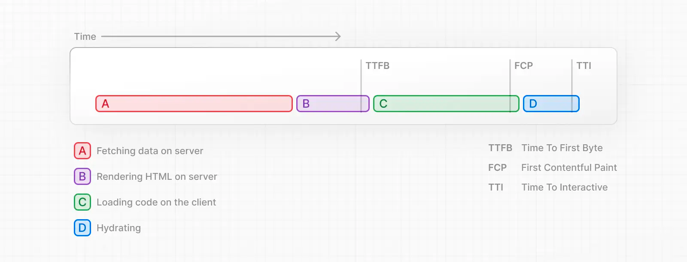
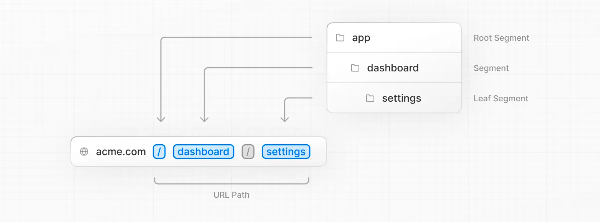
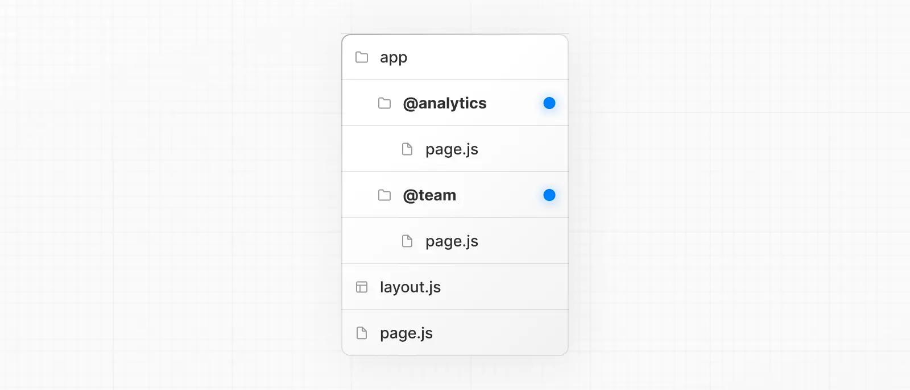
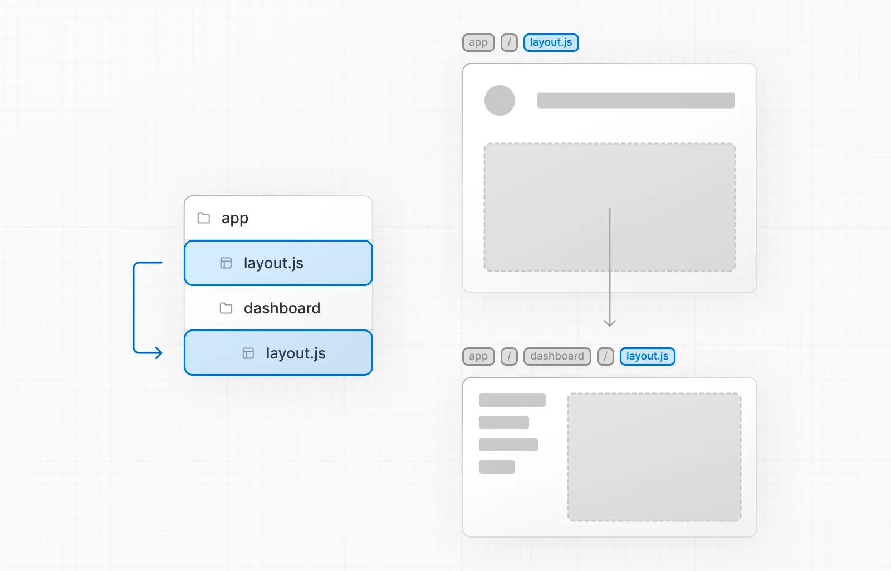

# TODO

- [ ] [Composition Patterns](https://nextjs.org/docs/app/building-your-application/rendering/composition-patterns)

- [ ] [Partial Prerendering](https://nextjs.org/docs/app/building-your-application/rendering/partial-prerendering)

- [ ] [Caching](https://nextjs.org/docs/app/building-your-application/caching)

- [ ] [Package Bundling](https://nextjs.org/docs/app/building-your-application/optimizing/package-bundling)

- [ ] [Instrumentation](https://nextjs.org/docs/app/building-your-application/optimizing/instrumentation)

- [ ] [Analytics](https://nextjs.org/docs/app/building-your-application/optimizing/analytics)

- [ ] [Third Party Libraries](https://nextjs.org/docs/app/building-your-application/optimizing/third-party-libraries)

# SSR

## 原理

Server-Side Render

使用 SSR 时，需要完成一系列步骤，然后用户才能看到页面并与之交互：

1. 首先，在服务器上获取给定页面的所有数据。
2. 然后，服务器呈现页面的 HTML。
3. 页面的 HTML、CSS 和 JavaScript 将发送到客户端。
4. 非交互式用户界面使用生成的 HTML 和 CSS 显示。
5. 最后，React [对用户界面进行水合](https://react.dev/reference/react-dom/client/hydrateRoot#hydrating-server-rendered-html)，使其具有交互性。



> 这些步骤是**连续**的和**阻塞**的，这意味着服务器只能在获取所有数据后呈现页面的 HTML。而且，在客户端上，React 只有在下载了页面中所有组件的代码后才能水合 UI。

## 优点

1. **数据获取**：服务器组件允许您将数据获取移动到服务器，靠近您的数据源。这可以通过减少获取渲染所需数据的时间和客户端需要发出的请求数量来提高性能。

2. **安全性**: 服务器组件允许您将敏感数据和逻辑保存在服务器上，例如令牌和 API 密钥，而不会将其暴露给客户端。

3. **缓存**：通过在服务器上渲染，结果可以被缓存并在后续请求和用户之间重复使用。这可以通过减少每个请求上的渲染和数据获取量来提高性能并降低成本。

4. **性能**：服务器组件为您提供了额外的工具，以优化基线性能。例如，如果您从完全由客户端组件组成的应用程序开始，将 UI 的非交互式部分移动到服务器组件可以减少所需的客户端 JavaScript 的数量。对于互联网速度较慢或设备性能较低的用户来说，这是有益的，因为浏览器需要下载、解析和执行的客户端 JavaScript 较少。

5. **初始页面加载和[首次内容绘制（FCP）](https://web.dev/fcp/)**：在服务器端，我们可以生成 HTML，让用户立即查看页面，而无需等待客户端下载、解析和执行渲染页面所需的 JavaScript。

6. **搜索引擎优化和社交网络分享性**：渲染的 HTML 可以被搜索引擎机器人用来索引您的页面，并被社交网络机器人用来生成您页面的社交卡片预览。

7. **流式传输**：服务器组件允许您将渲染工作分成块，并在准备就绪时将它们流式传输到客户端。这使用户可以在无需等待整个页面在服务器上渲染完成的情况下更早地看到页面的部分。

# 路由

文件系统 → 路由配置

仅 page.js 或 router.js 被公开访问。

## 嵌套路由




```TypeScript
// `app/dashboard/page.tsx` is the UI for the `/dashboard` URL
export default function Page() {
  return <h1>Hello, Dashboard Page!</h1>
}
```

## 路由组

通过（）包裹的父层文件夹不属于路径的一部分。


## 动态路由

通过 `[xxx]` or `[...xxx]` or `[[...xxx]]` 方式命名文件夹。

1. 单个动态区段

    | Route                     | Example URL | `params`        |
    | ------------------------- | ----------- | --------------- |
    | `app/blog/[slug]/page.js` | `/blog/a`   | `{ slug: 'a' }` |
    | `app/blog/[slug]/page.js` | `/blog/b`   | `{ slug: 'b' }` |
    | `app/blog/[slug]/page.js` | `/blog/c`   | `{ slug: 'c' }` |

1. 多个动态区段

    | Route                        | Example URL   | `params`                    |
    | ---------------------------- | ------------- | --------------------------- |
    | `app/shop/[...slug]/page.js` | `/shop/a`     | `{ slug: ['a'] }`           |
    | `app/shop/[...slug]/page.js` | `/shop/a/b`   | `{ slug: ['a', 'b'] }`      |
    | `app/shop/[...slug]/page.js` | `/shop/a/b/c` | `{ slug: ['a', 'b', 'c'] }` |

1. 全部动态区段

    | Route                          | Example URL   | `params`                    |
    | ------------------------------ | ------------- | --------------------------- |
    | `app/shop/[[...slug]]/page.js` | `/shop`       | `{ slug: undefined }`       |
    | `app/shop/[[...slug]]/page.js` | `/shop/a`     | `{ slug: ['a'] }`           |
    | `app/shop/[[...slug]]/page.js` | `/shop/a/b`   | `{ slug: ['a', 'b'] }`      |
    | `app/shop/[[...slug]]/page.js` | `/shop/a/b/c` | `{ slug: ['a', 'b', 'c'] }` |

## 并行路由

相关链接：

1. [Parallel Routes](https://nextjs.org/docs/app/building-your-application/routing/parallel-routes)

2. [useSelectedLayoutSegment(s)](https://nextjs.org/docs/app/building-your-application/routing/parallel-routes#useselectedlayoutsegments)

通过 @folder 定义。

类似 slot 插槽，Layout 中通过 props.folder 读取，类似 children。



```TypeScript
export default function Layout({
  children,
  team,
  analytics,
}: {
  children: React.ReactNode
  analytics: React.ReactNode
  team: React.ReactNode
}) {
  return (
    <>
      {children}
      {team}
      {analytics}
    </>
  )
}
```

> 可通过定义 default.tsx 作为最终的备选出口。

同样在 @folder 中也可以嵌套路由，嵌套路由之后，插槽只有在访问对应的 url 之后才会显示。

# 布局 & 模版

`/app/layout.tsx` `/app/xxx/layout.tsx`

app 路由中定义的 layout 即为组件局部路由可以进行嵌套。

Layout 分为两种：

1. *Root Layout「根布局」

2. Nesting Layout「嵌套布局」

> 顶层 Root Layout 是必备的，global.css 可在此处 import 。


同样 Template 也是类似 Layout 作为父层模板的。

不同的是，Template 会给每个子节点创建一个实例，因此在导航的过程中，会挂在新的子节点实例。「重载、不会保存状态」



# 导航

三种导航方式：

1. `<Link/>`

2. [useRouter hook](https://nextjs.org/docs/app/api-reference/functions/use-router)「Cilent」

3. redirect function 「Server」

4. History API

## Link

同其他框架一样，用法类似。

值得注意的是，Link 会 prefetch 「预加载」路由，加快访问速度。

## redirect

```TypeScript
import { redirect } from 'next/navigation'
 
async function fetchTeam(id: string) {
  const res = await fetch('https://...')
  if (!res.ok) return undefined
  return res.json()
}
 
export default async function Profile({ params }: { params: { id: string } }) {
  const team = await fetchTeam(params.id)
  if (!team) {
    redirect('/login')
  }
 
  // ...
}
```

注意：

1. 默认返回 307 状态码。

2. 其内部引发错误，可通过 try catch 捕获。

3. 可以在渲染过程中在 Client Components 中调用，但不能在事件处理程序中调用，需要改用 useRouter 钩子。

4. 接受绝对 URL，可用于重定向到外部链接。

5. 在渲染过程之前重定向，请使用 [next.config.js](https://nextjs.org/docs/app/building-your-application/routing/redirecting#redirects-in-nextconfigjs) 或 [Middleware](https://nextjs.org/docs/app/building-your-application/routing/redirecting#nextresponseredirect-in-middleware)。

## History API

1. window.history.pushState

2. window.history.replaceState

## 路由导航工作原理

1. code Split

2. prefeatch

3. cache

4. partial re-render

5. soft navigation

6. back and forward navigation

7. routing between page and app

### Code Split

App Router 采用混合模式组织路由和导航。

1. 在服务端将根据路由片段进行拆分代码。

2. 客户端则会对路由进行预加载和缓存。

### Prefeatch

`<Link>` 的默认预取行为（即当 `prefetch` prop 未指定或设置为 `null` 时）根据 `[loading.js](https://nextjs.org/docs/app/api-reference/file-conventions/loading)` 的使用情况而异。只有共享布局，沿着渲染的组件“树”一直到第一个`loading.js`文件，才会被预取并缓存 `30 秒`。

这降低了获取整个动态路由的成本，这意味着您可以显示[即时加载状态](https://nextjs.org/docs/app/building-your-application/routing/loading-ui-and-streaming#instant-loading-states)，以便向用户提供更好的视觉反馈。

> 预加载只在生产上有效

### Cache

Next.js 具有一个名为 [Router Cache](https://nextjs.org/docs/app/building-your-application/caching#client-side-router-cache) 的**内存中客户端缓存**。

因此在整个路由导航的过程中，会尽可能的复用缓存中的 Server Component，而不是走请求再次获取。

### Partial ReRender

部分 ReRender，只有正在发生导航的部分会发生 re-render，所有共享端都不会 re-render。

例如：Layout、Template 等。


如图中，在导航切换的时候只有 setting 以及 analytics 会 re-render。

### Soft Navigation

浏览器**硬导航** → next **软导航**

没懂啥意思 😅

### Back And Forward Navigation

前进回退会记住滚动条的位置，并复用原缓存。

### Routing Between Page And App

没懂啥意思 😅

### 相关 API

1. [usePathname()](https://nextjs.org/docs/app/api-reference/functions/use-pathname)

2. [useSearchParams()](https://nextjs.org/docs/app/api-reference/functions/use-search-params)

3. [Router Cache](https://nextjs.org/docs/app/building-your-application/caching#client-side-router-cache)

4. [即时加载状态](https://nextjs.org/docs/app/building-your-application/routing/loading-ui-and-streaming#instant-loading-states)

5. [loading.js](https://nextjs.org/docs/app/api-reference/file-conventions/loading)

6. [路由导航工作原理](https://nextjs.org/docs/app/building-your-application/routing/linking-and-navigating#how-routing-and-navigation-works)

# 异常捕获

错误分为两种：

1. expected error 预期错误

2. uncaught error 未捕获错误

在 Server Component 中预期错误，通常来自请求返回的明确的错误，可直接 return 出去。

```TypeScript
'use server'
 
import { redirect } from 'next/navigation'
 
export async function createUser(prevState: any, formData: FormData) {
  const res = await fetch('https://...')
  const json = await res.json()
 
  if (!res.ok) {
    return { message: 'Please enter a valid email' }
  }
 
  redirect('/dashboard')
}
```

其余未捕获「意料之外」的错误，通常通过上层 ErrorBoundary 捕获，也就是 error 组件。

同样 ErrorBoundary 可进行嵌套，内层也可通过 throw 抛出异常给上层捕获。

```TypeScript
'use client';

function Error({ error }) {
  // throw error
  return (
    <>
      about1-error
      <div>{error + ''}</div>
    </>
  );
}

export default Error;

```

# Loading


```TypeScript
export default function Loading() {
  // You can add any UI inside Loading, including a Skeleton.
  return <LoadingSkeleton />
}
```

loading 最终会被整合到 Suspense 的 fallback 中。

# Redirect

next 中重定向的方式有：

| API                                                                                                                                                                                                                                                                                                                                                  | Where                                             | Status Code                            |
| ---------------------------------------------------------------------------------------------------------------------------------------------------------------------------------------------------------------------------------------------------------------------------------------------------------------------------------------------------- | ------------------------------------------------- | -------------------------------------- |
| `[redirect](https://nextjs.org/docs/app/building-your-application/routing/redirecting#redirect-function)`                                                                                                                                                                                                                                            | Server Components, Server Actions, Route Handlers | 307 (Temporary) or 303 (Server Action) |
| `[permanentRedirect](https://nextjs.org/docs/app/building-your-application/routing/redirecting#permanentredirect-function)`                                                                                                                                                                                                                          | Server Components, Server Actions, Route Handlers | 308 (Permanent)                        |
| `[useRouter](https://nextjs.org/docs/app/building-your-application/routing/redirecting#userouter-hook)`                                                                                                                                                                                                                                              | Event Handlers in Client Components               | N/A                                    |
| `[redirects](https://nextjs.org/docs/app/building-your-application/routing/redirecting#redirects-in-nextconfigjs)`[ in ](https://nextjs.org/docs/app/building-your-application/routing/redirecting#redirects-in-nextconfigjs)`[next.config.js](https://nextjs.org/docs/app/building-your-application/routing/redirecting#redirects-in-nextconfigjs)` | `next.config.js` file                             | 307 (Temporary) or 308 (Permanent)     |
| `[NextResponse.redirect](https://nextjs.org/docs/app/building-your-application/routing/redirecting#nextresponseredirect-in-middleware)`                                                                                                                                                                                                              | Middleware                                        | Any                                    |

## redirect

```TypeScript
'use server'
 
import { redirect } from 'next/navigation'
import { revalidatePath } from 'next/cache'
 
export async function createPost(id: string) {
  try {
    // Call database
  } catch (error) {
    // Handle errors
  }
 
  revalidatePath('/posts') // Update cached posts
  redirect(`/post/${id}`) // Navigate to the new post page
}
```

> 默认返回 307，在服务端组件中返回 303，这通常用于作为 POST 请求的结果重定向到成功页面。

## useRouter

类似其他路由库，push、replace 跳转路由。

## redirects in nextConfig

```TypeScript
/** @type {import('next').NextConfig} */
const nextConfig = {
  redirects() {
    return [
      {
        // 源
        source: '/about',
        // 目标
        destination: '/about/about1',
        // 永久重定向
        permanent: true,
      },
    ];
  },
};

export default nextConfig;
```

注意：

1. 重定向可以返回 307 （Temporary Redirect） 或 308 （Permanent Redirect） 状态代码。

2. 重定向可能会收到平台的限制。例如，在 Vercel 上，重定向限制为 1,024 次。

3. redirect 在 Middleware **之前**运行。

## NextResponse.redirect in Middleware

中间件允许您在请求完成之前运行代码。

例如身份校验、会话管理等。

```TypeScript
import { NextResponse, NextRequest } from 'next/server'
import { authenticate } from 'auth-provider'
 
export function middleware(request: NextRequest) {
  const isAuthenticated = authenticate(request)
 
  // If the user is authenticated, continue as normal
  if (isAuthenticated) {
    return NextResponse.next()
  }
 
  // Redirect to login page if not authenticated
  return NextResponse.redirect(new URL('/login', request.url))
}
 
// 匹配url
export const config = {
  matcher: '/dashboard/:path*',
}
```

## 大规模重定向

1. redirect store

2. middlerware

```TypeScript
{
  "/old": {
    "destination": "/new",
    "permanent": true
  },
  "/blog/post-old": {
    "destination": "/blog/post-new",
    "permanent": true
  }
}
```

```TypeScript
import { NextResponse, NextRequest } from 'next/server'
import { get } from '@vercel/edge-config'
 
type RedirectEntry = {
  destination: string
  permanent: boolean
}
 
export async function middleware(request: NextRequest) {
  const pathname = request.nextUrl.pathname
  const redirectData = await get(pathname)
 
  if (redirectData && typeof redirectData === 'string') {
    const redirectEntry: RedirectEntry = JSON.parse(redirectData)
    const statusCode = redirectEntry.permanent ? 308 : 307
    return NextResponse.redirect(redirectEntry.destination, statusCode)
  }
 
  // No redirect found, continue without redirecting
  return NextResponse.next()
}
```

[优化](https://nextjs.org/docs/app/building-your-application/routing/redirecting#managing-redirects-at-scale-advanced)：redis、bloomFilter

# Font

## google font

```TypeScript
import { Inter, Roboto_Mono } from 'next/font/google'
 
export const inter = Inter({
  subsets: ['latin'],
  display: 'swap',
})
 
export const roboto_mono = Roboto_Mono({
  subsets: ['latin'],
  display: 'swap',
})
```

```TypeScript
import { inter } from './fonts'
 
export default function Layout({ children }: { children: React.ReactNode }) {
  return (
    <html lang="en" className={inter.className}>
      <body>
        <div>{children}</div>
      </body>
    </html>
  )
}
```

**css 动态变量**

```TypeScript
import { Inter, Roboto_Mono } from 'next/font/google'
import styles from './global.css'
 
const inter = Inter({
  subsets: ['latin'],
  variable: '--font-inter',
  display: 'swap',
})
 
const roboto_mono = Roboto_Mono({
  subsets: ['latin'],
  variable: '--font-roboto-mono',
  display: 'swap',
})
 
export default function RootLayout({
  children,
}: {
  children: React.ReactNode
}) {
  return (
    <html lang="en" className={`${inter.variable} ${roboto_mono.variable}`}>
      <body>
        <h1>My App</h1>
        <div>{children}</div>
      </body>
    </html>
  )
}
```

## local font

```TypeScript
import localFont from 'next/font/local'
 
// Font files can be colocated inside of `app`
const myFont = localFont({
  src: './my-font.woff2',
  // 多个字体
  // src: [],
  display: 'swap',
})
 
export default function RootLayout({
  children,
}: {
  children: React.ReactNode
}) {
  return (
    <html lang="en" className={myFont.className}>
      <body>{children}</body>
    </html>
  )
}
```

## with tailwindcss

css 变量 → tailwindcss.config.theme

```TypeScript
/** @type {import('tailwindcss').Config} */
module.exports = {
  content: [
    './pages/**/*.{js,ts,jsx,tsx}',
    './components/**/*.{js,ts,jsx,tsx}',
    './app/**/*.{js,ts,jsx,tsx}',
  ],
  theme: {
    extend: {
      fontFamily: {
        sans: ['var(--font-inter)'],
        mono: ['var(--font-roboto-mono)'],
      },
    },
  },
  plugins: [],
}
```

# Metadata

可通过 eport metadata 对象实现对页面元数据的修改，仅在 **Server Component** 中生效

eg：link、meta、title。

## Static Metadata

[Api Reference](https://nextjs.org/docs/app/api-reference/functions/generate-metadata)

```TypeScript
import type { Metadata } from 'next'
 
export const metadata: Metadata = {
  title: '...',
  description: '...',
}
 
export default function Page() {
  return '...'
}
```

## Dynamic Metadata

通过暴露 generateMetadata 函数实现。

```TypeScript
import type { Metadata, ResolvingMetadata } from 'next'
 
type Props = {
  params: Promise<{ id: string }>
  searchParams: Promise<{ [key: string]: string | string[] | undefined }>
}
 
export async function generateMetadata(
  { params, searchParams }: Props,
  parent: ResolvingMetadata
): Promise<Metadata> {
  // read route params
  const id = (await params).id
 
  // fetch data
  const product = await fetch(`https://.../${id}`).then((res) => res.json())
 
  // optionally access and extend (rather than replace) parent metadata
  const previousImages = (await parent).openGraph?.images || []
 
  return {
    title: product.title,
    openGraph: {
      images: ['/some-specific-page-image.jpg', ...previousImages],
    },
  }
}
 
export default function Page({ params, searchParams }: Props) {}
```

## Meta文件

这些文件会有更高的优先级。

- [favicon.ico, apple-icon.jpg, and icon.jpg](https://nextjs.org/docs/app/api-reference/file-conventions/metadata/app-icons)

- [opengraph-image.jpg and twitter-image.jpg](https://nextjs.org/docs/app/api-reference/file-conventions/metadata/opengraph-image)

- [robots.txt](https://nextjs.org/docs/app/api-reference/file-conventions/metadata/robots)

- [sitemap.xml](https://nextjs.org/docs/app/api-reference/file-conventions/metadata/sitemap)

# 懒加载

1. `[React.lazy()](https://react.dev/reference/react/lazy)` + Suspense

2. [Dynamic Imports](https://nextjs.org/docs/app/building-your-application/optimizing/lazy-loading#nextdynamic)

```TypeScript
'use client'
 
import { useState } from 'react'
import dynamic from 'next/dynamic'
 
// Client Components:
const ComponentA = dynamic(() => import('../components/A'))
const ComponentB = dynamic(() => import('../components/B'))
const ComponentC = dynamic(() => import('../components/C'), { ssr: false })
 
export default function ClientComponentExample() {
  const [showMore, setShowMore] = useState(false)
 
  return (
    <div>
      {/* Load immediately, but in a separate client bundle */}
      <ComponentA />
 
      {/* Load on demand, only when/if the condition is met */}
      {showMore && <ComponentB />}
      <button onClick={() => setShowMore(!showMore)}>Toggle</button>
 
      {/* Load only on the client side */}
      <ComponentC />
    </div>
  )
}
```

> 服务器组件使用 dynamic 时，只有服务器组件子级的客户端组件将被延迟加载，对服务器组件

## 跳过SSR

使用 React.lazy 客户端组件会默认预渲染。

通过 { ssr: false } 配置以取消。「服务器组件不支持该配置」

```TypeScript
const ComponentC = dynamic(() => import('../components/C'), { ssr: false })

/*
** dynamic options 
*/
export type DynamicOptions<P = {}> = LoadableGeneratedOptions & {
    loading?: (loadingProps: DynamicOptionsLoadingProps) => JSX.Element | null;
    loader?: Loader<P> | LoaderMap;
    loadableGenerated?: LoadableGeneratedOptions;
    ssr?: boolean;
    /**
     * @deprecated `suspense` prop is not required anymore
     */
    suspense?: boolean;
};
```

# 内置组件

1. [Image](https://nextjs.org/docs/app/api-reference/components/image)

2. [Script](https://nextjs.org/docs/app/api-reference/components/script)


# libs

1. [next-video](https://next-video.dev/)

2. [@next/third-parties](https://www.npmjs.com/package/@next/third-parties) 「三方库」

# 相关资料

1. [中文文档](https://nextjs.net.cn/)


